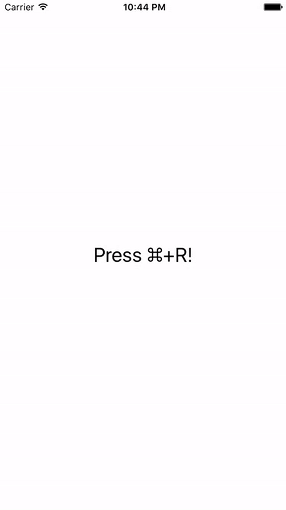

# KeyCommands

👷 Project created and maintained by [Rafał Augustyniak](http://augustyniak.me). You can find me on twitter ([@RaAugustyniak](https://twitter.com/RaAugustyniak)).

⚠️️ See my post regarding the implementation of `KeyCommands`: [Introducing KeyCommands](http://augustyniak.me/post/2016/10/introducing-keycommands/).

# Introduction

KeyCommands is an easy way to bind actions to specified combinations of keys in applications running in iOS or tvOS simulators.

-------

<p align="center">
    <a href="#why">Why KeyCommands</a> &bull;
    <a href="#installation">Installation</a> &bull;
    <a href="#usage">Usage</a>
</p>

-------

iOS Simulator             |  tvOS Simulator
:-------------------------:|:-------------------------:
 | 


# Why

Debugging and testing are both hard and can cost a lot of time. In order to test or verify something, it's convienient to have a way to trigger some action during the normal execution of the program. It's especially needed when applications run in simulators, where normally most of the development happens (as compile & run cycle is faster for simulators). Normally, this kind of actions are launched using lldb commands or some special UI debug elements that are added to the user interface specially for that purpose (and need to be removed after they are no longer needed). Both of these approaches are neither convinient nor time efficient. 

KeyCommands provide an alternative to the described problem. It provides an easy way to register observers that are informed when some specified combination of keys is pressed while application is running in the simulator. It's easy to use and can be easily disabled when needed.


## Possible Handy Applications of KeyCommands

Some of the actions that can be bound to specified key combinations:

1. Changing tabs in tab bar.
2. Tapping back button in navigation bar.
3. Tapping buttons in alert sheets.
4. Scrolling in scroll view.
5. ...

## Keeping Swizzling out of App Store Builds
As swizzling isn't a best practice and can lead to App Store rejections, all methods of KeyCommands expand to empty definitions in builds for actual devices. This keeps swizzling out of the builds that are sent to App Store and allows developers to sleep well at night. 🙂


```Swift
#if (arch(i386) || arch(x86_64)) && (os(iOS) || os(tvOS)) //true for simulators
//Magic happens here
#else
//Empty definitions of methods
#end
```

## Notes

Note that some combinations of keys don't work with KeyCommands. All combinations that match shortcuts of iOS and/or tvOS simulators (for example ⌘+S) don't work as mentioned simulators don't forward them to the running applications.

# Installation 

KeyCommands supports multiple methods for installing the library in the project.

## Installation with CocoaPods

[CocoaPods](http://www.cocoapods.org) is the recommended way to add KeyCommands to your project. You can install it with the following command:

```gem install cocoapods```

To integrate KeyCommands in your project using CocoaPods, perform following steps:

1. Add additional entry to your Podfile.

  ```ruby
  pod 'KeyCommands', '~> 1.0.0'
  ```
1. Install Pod(s) running `pod install` command.  
1. Import KeyCommands module in your app using following code `import KeyCommands`.

## Installation with Carthage

You can install [Carthage](https://github.com/Carthage/Carthage) with [Homebrew](http://brew.sh) using following commands:

```
brew update
brew install carthage
```

To integrate KeyCommands into your Xcode project add KeyCommands to your Carfile:

```
github "Augustyniak/KeyCommands" ~> 1.0
```

Run `carthage update` and drag created KeyCommands framework into your project.

# Usage 

Registration for `⌘+R` key combination can be performed with the following code:

```ObjectiveC
KeyCommands.registerKeyCommand("r", modifierFlags: .Command) {
	print("⌘+R pressed.")
}	
```

Registered key command can be easily deregistered if needed:

```ObjectiveC
KeyCommands.unregisterKeyCommand("r", modifierFlags: .Command)
```

# Credits

KeyCommands are highly inspired by RCTKeyCommands class from [React Native](https://github.com/facebook/react-native) project.
